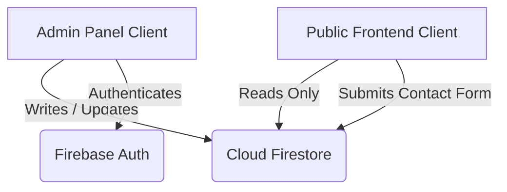

# Project Architecture & Tech Stack

This document describes the high-level system architecture, directories, frontend components, administrative interface, and the deployment structure of the portfolio project.

---

## 1. Directory Structure

The project is structured as a monorepo containing two distinct Next.js applications and global Firebase configuration files at the root level:

```text
shashika-mora/
├── admin_panel/            # Next.js app for profile & content management
│   ├── src/
│   │   ├── app/            # App Router files (profile, projects, blogs, etc.)
│   │   └── lib/            # Firebase client setup & Firestore service
│   ├── public/
│   └── package.json
│
├── frontend/               # Next.js app for the public portfolio website
│   ├── src/
│   │   ├── app/            # Public pages (projects, blogs, timeline, contact)
│   │   ├── components/     # UI elements (Navbar, Footer, background grid, etc.)
│   │   └── lib/            # Read-only Firestore client operations
│   ├── public/             # Static assets (including hero.jpg profile photo)
│   └── package.json
│
├── doc/                    # Architectural & project documentation (this folder)
├── firestore.rules         # Security rules governing database read/write access
├── firestore.indexes.json  # Multi-field database query indexes
├── firebase.json           # Firebase Hosting and Firestore configuration
└── .firebaserc             # Firebase projects and multi-site target mapping
```

---

## 2. Technical Stack

Both applications are built on a modern, unified technology stack:

*   **Framework**: Next.js (version `16.2.10`) using the App Router.
*   **Static Site Generation (SSG)**: Configured with `output: 'export'` in both `next.config.mjs` files to generate lightweight, high-performance static HTML/JS/CSS assets that can be served directly from CDN nodes.
*   **Styling**: Vanilla CSS alongside Tailwind CSS (version `4.x`) for styling and layout utilities.
*   **Animations**: GreenSock Animation Platform (GSAP version `3.15.0`) coupled with `@gsap/react` for rich micro-interactions, floating elements, and scroll-reveal triggers.
*   **Database**: Google Cloud Firestore (NoSQL Document Database).
*   **Hosting**: Firebase Hosting (Multi-site distribution).

---

## 3. Communication & Data Flow

Communication between the user-facing frontend, the admin panel, and the database is direct and decoupled:



### Administrative Operations (Write / Read)
*   The **Admin Panel** uses the client-side Firebase Web SDK to perform CRUD operations on Firestore collections.
*   It requires authentication (Firebase Auth). Operations are restricted to authenticated administrators using security rules (`firestore.rules`).

### Public Operations (Read Only / Restricted Write)
*   The **Frontend** queries the same Firestore instance directly on client mount.
*   It reads profile settings, project lists, timeline items, and blog posts.
*   It has write access *only* to the `messages` collection to submit contact form messages, governed strictly by security rules to prevent modification of existing documents.

---

## 4. Multi-Site Hosting Architecture

The system uses Firebase Hosting's multi-site capabilities to host the two applications separately under the same project (`shashika-dev`):

1.  **Frontend Website**: Deployed to `shashika-dev.web.app` (or custom mapped domains).
2.  **Admin Panel**: Deployed to `shashika-dev-admin.web.app`.

### Target Mapping (`.firebaserc`)
Hosting targets are defined to route the correct output directories to the correct sites:
```json
"targets": {
  "shashika-dev": {
    "hosting": {
      "frontend": ["shashika-dev"],
      "admin": ["shashika-dev-admin"]
    }
  }
}
```

### Build Directories (`firebase.json`)
The static outputs generated by Next.js are routed to Hosting:
*   `frontend/out` is deployed to the `frontend` target.
*   `admin_panel/out` is deployed to the `admin` target.
