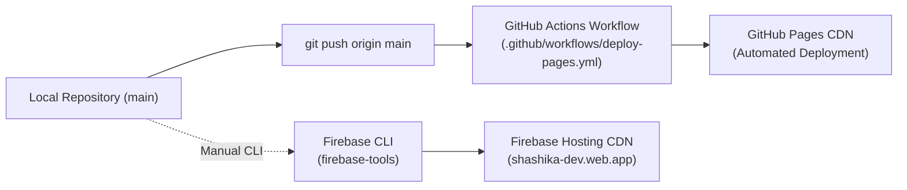

# Project Architecture & System Design

This document describes the production architecture, directory structure, canvas particle physics engine, and dual deployment infrastructure of Shashika's personal engineering space.

---

## 1. Architectural Philosophy

The website is engineered under strict architectural constraints:
* **Dependency-Free Static Delivery**: Built exclusively with semantic HTML5, pure CSS3, and modern vanilla JavaScript (ES6+). Zero npm dependencies, zero build steps, and zero client-side framework overhead.
* **Instant First Contentful Paint (FCP)**: The root files are delivered directly from CDN edge caches with sub-second initial render times.
* **Celestial Aesthetics & Hardware-Accelerated Physics**: Dark space theme with fluid typography, responsive layout grids, and interactive 60fps canvas particle constellations.
* **Dual Deployment Pipeline**: Redundant automated deployment supporting GitHub Pages (via GitHub Actions workflow) and Firebase Hosting with edge caching.
* **Preserved Remote Firestore**: Cloud Firestore rules and indexes are maintained at root to preserve the remote database configuration.

---

## 2. Directory Structure

```text
shashika-mora/
├── index.html                # Semantic HTML5 single-page application & content layout
├── style.css                 # Pure CSS3 styling (variables, typography, carousel, responsive grid)
├── script.js                 # Vanilla JS engine (canvas starfield, modal system, carousel pagination)
├── particle-shapes.json      # Coordinate matrices for morphing canvas constellations (brain, person, tools, plane)
│
├── public/                   # Static media and branding assets
│   ├── favicon.svg           # Official brand logo (lime badge with dark 'sd' monogram)
│   ├── cosmos.webp           # Optimized cosmic space background texture
│   ├── enigma-2026.png       # Enigma 2026 platform preview interface
│   ├── logo_and_name_transperant_bg.png  # Sasnaka Sansada DTT organization badge
│   ├── buslk_poster.jpg      # BusLK public transit application interface
│   ├── nano_processor.jpg    # Nano Processor VHDL microarchitecture schematic
│   ├── portfolio_img.png     # Celestial portfolio preview asset
│   └── Shashika_CV.pdf       # Printable engineering curriculum vitae
│
├── .github/
│   └── workflows/
│       └── deploy-pages.yml  # GitHub Actions automated deployment workflow to GitHub Pages
│
├── firebase.json             # Firebase Hosting distribution and cache headers configuration
├── .firebaserc               # Firebase project mapping ('shashika-dev')
├── firestore.rules           # Firestore security rules governing remote database access
├── firestore.indexes.json    # Firestore composite query index definitions
│
├── doc/                      # Technical documentation & architectural records
│   ├── architecture.md       # Production architecture & tech stack (this document)
│   ├── completed_enhancements.md # Historical log of system enhancements
│   ├── database_schema.md    # Remote Firestore schema documentation
│   └── future_enhancements.md   # Roadmap for upcoming technical explorations
│
├── .workspace/               # Local workspace reference documents (excluded from git)
│   ├── profile.md            # Comprehensive personal background, education & roadmap
│   ├── projects.md           # Deep-dive architecture & tech stacks of featured projects
│   ├── skills-and-toolkit.md # Complete inventory of tools, languages & platforms
│   ├── process-and-architecture.md # Development history, changelog & system decisions
│   ├── cheatsheet-and-commands.md  # CLI command quick reference
│   └── README.md             # Workspace overview & navigation
│
└── README.md                 # Public GitHub profile readme & connect portal
```

---

## 3. Core System Components

### 3.1 HTML5 Canvas Particle Engine
* **File**: `script.js` & `particle-shapes.json`
* **Mechanics**:
  * An ambient background starfield runs continuously across the viewport, adjusting density based on screen dimensions and device pixel ratio.
  * Morphing constellations (`brain`, `person`, `tools`, `plane`) are bound to `.particle-anchor` containers across page sections.
  * Particle positions interpolate smoothly from cosmic scatter into defined coordinate shapes as sections scroll into view.
  * Fully accessible with `prefers-reduced-motion` compliance.

### 3.2 Discrete 4-Card Page Carousel
* **Capacity Constraint**: Exactly 4 projects display on screen at a time in a clean 2x2 grid.
* **Pagination Calculation**: `totalPages = Math.ceil(totalProjects / 4)`.
* **State Management**:
  * Page 1 (Cards 1–4): Enigma 2026, Sasnaka DTT, BusLK, Nano Processor.
  * Page 2 (Card 5+): Celestial Portfolio, scalable for future project additions.
* **Strict User Intent**: Auto-sliding is disabled. Cards advance strictly on explicit arrow button or dot indicator clicks.
* **Direct Actions**: Each card provides direct `Repo` and `Live Web` links alongside the expanded `Details +` modal trigger.

### 3.3 Modal Dialog System
* **Element**: Native HTML5 `<dialog id="detail">`.
* **Features**: Accessible modal trap, backdrop blur filter, scroll lock on `document.body`, outside-click dismiss, and keyboard `Escape` closing.

### 3.4 Contact & Email Integration
* **Primary Email**: `shashikatheekshana67@gmail.com`.
* **Say hello**: Direct `mailto:shashikatheekshana67@gmail.com` link.
* **Copy email**: Clipboard API integration (`navigator.clipboard.writeText`) with dynamic status feedback.

---

## 4. Dual Deployment Pipeline


```mermaid
flowchart LR
    Dev["Local Repository (main)"] --> Push["git push origin main"]
    Push --> GA["GitHub Actions Workflow<br>(.github/workflows/deploy-pages.yml)"]
    GA --> GHP["GitHub Pages CDN<br>(Automated Deployment)"]
    Dev -. Manual CLI .-> FB["Firebase CLI<br>(firebase-tools)"]
    FB --> FBH["Firebase Hosting CDN<br>(shashika-dev.web.app)"]
```

1. **GitHub Pages (Automated CI/CD)**: Triggered automatically on every push to `main` via official GitHub Pages actions (`actions/upload-pages-artifact@v3` and `actions/deploy-pages@v4`).
2. **Firebase Hosting**: Deployed to `shashika-dev.web.app` using `firebase.json` with edge-caching rules and cache-busting version query parameters (`?v=2.x`).
